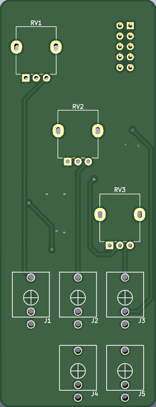
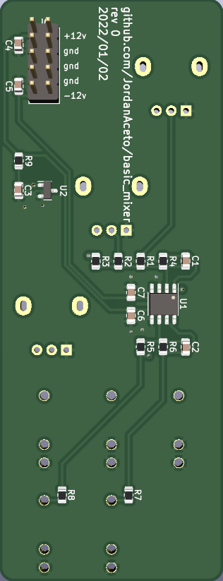

# Basic Eurorack 3 channel DC coupled mixer

Normal and inverting outputs are available.

Input 3 is normallized to a +5 volt reference for a convenient DC offset source.

## Status of the project:

Task | Status |
---------|--------------|
Schematic capture | &#9745;
PCB layout | &#9745;
Test build | &#9744;
Safe to order boards| &#9744;
